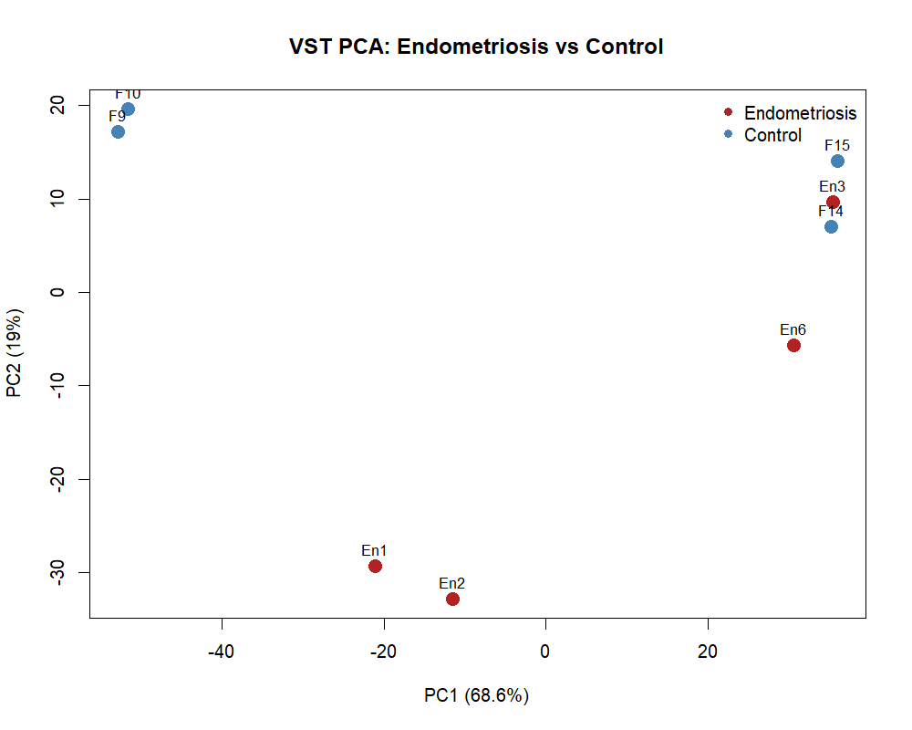
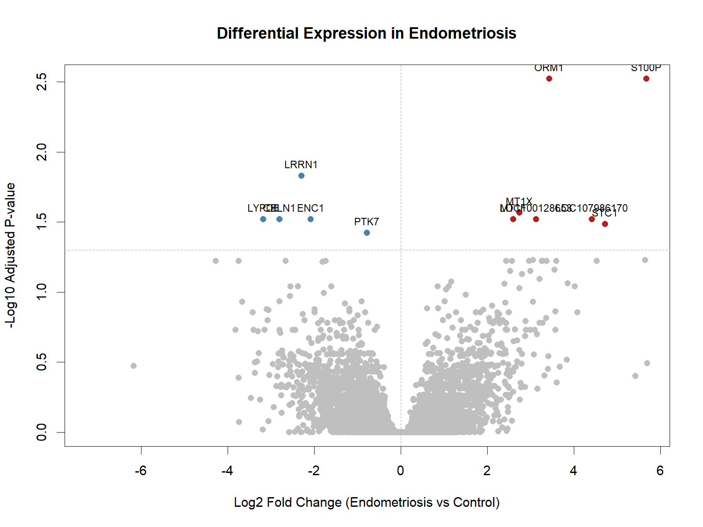
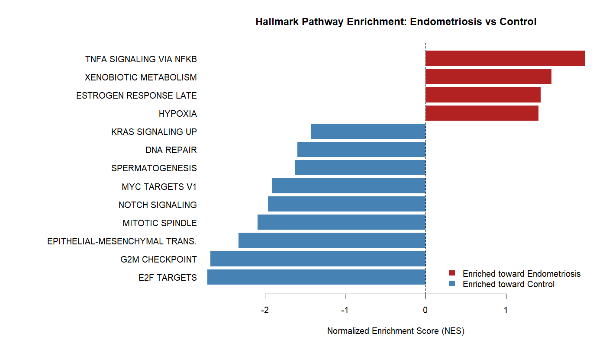

# Endometriosis Transcriptomics Analysis

## Overview

This project analyzes publicly available RNA-seq data to investigate transcriptomic differences associated with endometriosis.

Using the NCBI GEO dataset GSE153740, I developed a reproducible workflow to compare mid-secretory eutopic endometrial samples from women with endometriosis and controls (n=4 per group).

The analysis includes sample-level quality assessment, differential gene expression using DESeq2, gene annotation, and ranked gene-set enrichment analysis using MSigDB Hallmark pathways.

Given the small cohort, results are interpreted as exploratory rather than as clinically validated biomarkers.

## Research Questions

- Do endometriosis and control samples show distinct global transcriptomic patterns?
- Which genes differ in expression between endometriosis and control samples?
- Which biological pathways show coordinated enrichment across the ranked transcriptome?
- How should gene- and pathway-level findings be interpreted given sample-level heterogeneity and limited cohort size?

## Analysis Workflow

1. Selected and evaluated human endometriosis RNA-seq dataset GSE153740
2. Reviewed sample metadata and experimental design
3. Assessed sequencing depth and filtered low-count genes
4. Applied variance-stabilizing transformation for sample-level PCA
5. Performed differential expression analysis with DESeq2
6. Annotated gene-level differential-expression results
7. Ranked genes using DESeq2 Wald statistics
8. Performed Hallmark gene-set enrichment analysis with fgsea and MSigDB
9. Generated PCA, volcano, and pathway-enrichment visualizations

## Tools

- R
- DESeq2
- fgsea
- msigdbr / MSigDB Hallmark gene sets
- Python
- pandas
- NumPy
- matplotlib / seaborn
- Jupyter Notebook
- Git / GitHub

## Results Summary

### Sample-level variation

Variance-stabilizing transformation followed by PCA showed substantial sample-level heterogeneity. PC1 and PC2 explained 68.6% and 19.0% of the total variance, respectively.

Endometriosis and control samples did not separate cleanly in PCA space, suggesting that disease status was not the dominant source of global transcriptomic variation in this small cohort.



### Differential expression

Differential expression analysis was performed using DESeq2 on NCBI-generated raw gene counts.

Genes were retained if they had at least 10 counts in at least 4 samples. At an adjusted p-value threshold of 0.05:

- 12 genes were differentially expressed
- 7 showed higher expression in endometriosis
- 5 showed lower expression in endometriosis

Leading signals included S100P, ORM1, MT1X, MT1F, STC1, LRRN1, ENC1, CBLN1, and LYPD6.



### Pathway enrichment

Ranked gene-set enrichment analysis was performed using the DESeq2 Wald statistic and MSigDB Hallmark gene sets.

Thirteen Hallmark pathways were significant at FDR < 0.05.

Positive enrichment toward endometriosis included TNF-alpha/NF-kB signaling, late estrogen response, hypoxia, and xenobiotic metabolism.

Negative enrichment included E2F targets, G2M checkpoint, mitotic spindle, MYC targets, DNA repair, Notch signaling, and other pathways.



### Interpretation

The cohort does not show clear global transcriptomic separation by disease status, and the small sample size limits statistical power and generalizability.

However, the analysis identifies a focused set of gene-level differences and coordinated pathway-level signals that may warrant further investigation in larger independent cohorts.

These findings should be considered exploratory and should not be interpreted as clinically validated biomarkers.

## Repository Structure

```text
data/        Dataset documentation and metadata
notebooks/   Exploratory analyses and notebooks
src/         Reusable analysis scripts
results/     Generated figures and analysis outputs
```

## Dataset

This project uses GSE153740 from the NCBI Gene Expression Omnibus (GEO), a bulk RNA-seq dataset of mid-secretory eutopic endometrial samples.

The analysis includes:

- 4 samples from women with endometriosis
- 4 control samples
- 8 samples total

Exploratory analysis uses the submitter-provided transcript-level expression matrix. Formal differential-expression analysis uses the NCBI-generated gene-level raw count matrix because DESeq2 requires count data rather than normalized FPKM values.

## Data Source and Citation

This project analyzes the publicly available **GSE153740** RNA-seq dataset from the NCBI Gene Expression Omnibus (GEO). The dataset contains mid-secretory phase eutopic endometrial samples from women with endometriosis (n = 4) and controls without endometriosis (n = 4).

**GEO accession:** GSE153740
**BioProject:** PRJNA643840
**SRA:** SRP269814

The original study processed RNA-seq reads using a workflow including Cutadapt, HISAT2, Cufflinks, and Cuffdiff and provided transcript-level FPKM expression estimates. This project uses the submitter-provided transcript expression matrix for exploratory analysis and the NCBI-generated gene-level raw count matrix for the DESeq2 differential expression workflow. Because the gene-level counts were generated independently by NCBI rather than by reproducing the original study's transcript-level pipeline, results from this analysis are not expected to exactly reproduce the published results.

### Original Study

Bane K, Desouza J, Shetty D, et al. **Endometrial DNA damage response is modulated in endometriosis.** *Human Reproduction.* 2021;36(1):160–174. doi:10.1093/humrep/deaa255. PMID: 33246341.


## Reproducibility

Exploratory data analysis is documented in:

```text
notebooks/01_data_exploration.ipynb
```

The R workflow for differential expression, annotation, and pathway enrichment is implemented in:

```text
src/deseq2_analysis.R
```

From the repository root, the R analysis can be run with:

```bash
Rscript src/deseq2_analysis.R
```

Key output tables are available under `results/tables/`, while generated figures are stored under `results/figures/`.

R and Bioconductor package versions used for the analysis are recorded in `results/sessionInfo.txt`.

## Limitations

This analysis is exploratory and has several important limitations:

- The cohort is small, with 4 endometriosis and 4 control samples.
- PCA does not show clean global separation between disease groups.
- The analysis does not include an independent validation cohort.
- NCBI-generated gene-level counts are used for differential expression and may differ from the transcript-level quantification used in the original study.
- Differentially expressed genes and enriched pathways should therefore be treated as hypotheses for further investigation rather than diagnostic or clinically validated biomarkers.
